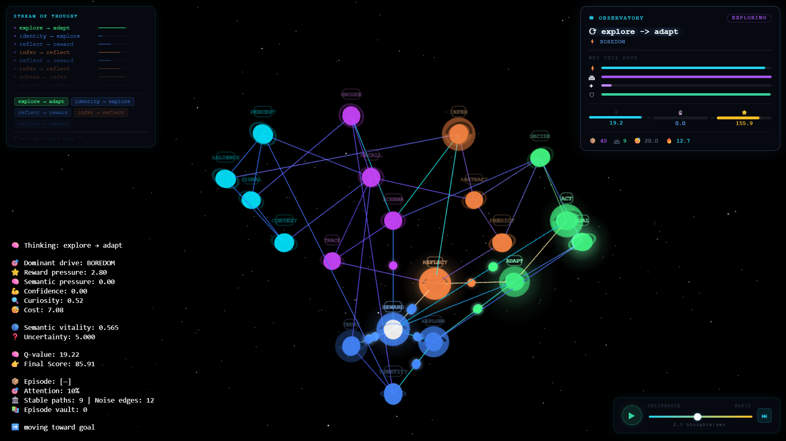

# MiniFlyWire

> A real-time 3D agent that moves through a 20-node concept graph — and an audit-driven
> research programme that measures which of its mechanisms actually change what it does.

<p align="center">
  
</p>

[▶️ 20-second demo](Portfolio_Assets/MiniFlyWire/assets/videos/demo.mp4) ·
**Portfolio:** https://manish-portfolio-one-gamma.vercel.app

---

## In 30 seconds

- **What it is.** A browser app (Three.js) where an agent chooses its next node by combining a
  learned score (Q-learning, reward and habit memory, trust) with a competitive arbitration step,
  and shows its internal state live in a HUD.
- **What makes it different.** I audited my own system, found that several of its "cognitive"
  modules did not affect behaviour, and then repaired and measured it under frozen,
  preregistered protocols with executable verification gates.
- **What is verified.** Five defects are repaired and gated (Q-value namespace, scoring
  sign inversions, goal-aware Q lookup, seeded randomness, the exploration branch).
  13 gate scripts: 11 fully green, 2 keep one historical failure each, superseded by corrected
  gates that pass.
- **What is open.** The executive controller has **no effect** on the main (60%) scoring path.
  The look-ahead (`futureScore`) id defect is **not repaired**. Neither is presented as solved.
- **What it is not.** It is not a demonstrated cognitive architecture. The audit's verdict — a
  heuristic scoring function over a fully observable graph — has not been overturned.

**Full evidence:** [`docs/VERIFICATION_STATUS.md`](docs/VERIFICATION_STATUS.md)

---

## Status at a glance

| Area | Status | Evidence |
|---|---|---|
| Q-learning value namespace (D1) | ✅ Repaired · verified | [`verify_S2.js`](experiments/phase1_0/verify_S2.js) |
| Scoring sign inversions (D3) | ✅ Repaired · verified | [`verify_S1.js`](experiments/phase1_0/verify_S1.js) |
| Goal-aware Q lookup (Q4) | ✅ Repaired · verified | [`verify_S2_Q4.js`](experiments/phase1_0/verify_S2_Q4.js) |
| Seeded, reproducible randomness (Q3) | ✅ Repaired · verified | [`verify_S4.js`](experiments/phase1_0/verify_S4.js) |
| Exploration branch (F2) | ✅ Repaired · verified by corrected gate | [`verify_S3prime.js`](experiments/phase1_0/verify_S3prime.js) |
| Executive controller → main scoring path | ❌ **Open** — inert (influence 0, capability 8.06) | [`exec_influence/report.json`](experiments/exec_influence/report.json) |
| Look-ahead planning (`futureScore`, D2) | ❌ **Open** — id defect not repaired | [`render/planning.js`](render/planning.js) |
| Prediction error in the browser app | ⚠️ Zero by construction — environment is fully observable | [Status §6](docs/VERIFICATION_STATUS.md) |
| Hidden-structure environment | 🧪 Harness only — not in the browser app | [`experiments/m7/env.js`](experiments/m7/env.js) |

---

## How a decision is made

```text
candidate neighbours
   ├─ learned score (60%)   Q-value, rewards, habits, trust, look-ahead, penalties, attention
   └─ arbitration   (40%)   competitive weighting of reward, semantic, confidence, curiosity, cost, schema
            ▼
   softmax → epsilon-greedy → move → Q-learning, reward and memory updates → HUD
```

The executive controller's weights are computed but read under field names that do not exist on
the 60% path — see [Status §5](docs/VERIFICATION_STATUS.md).

---

## Research method

- **Audit first.** A read-only audit with falsification probes:
  [`research/cognitive-audit/`](research/cognitive-audit/).
- **Preregistration.** Each study is written and frozen (SHA-256) before data collection:
  [`research/preregistrations/`](research/preregistrations/).
- **Executable gates.** Later verifiers include mutation tests that confirm a gate can fail.
- **Errata, never edits.** Failed or superseded gates stay in the repository and still run.
- **Null and inconclusive results are reported as such** (e.g. Q1: *inconclusive — insufficient
  material*).

---

## Run it

**Browser app.** The page loads `neurons.json` and `connections.json` with `fetch`, so serve the
repository root over HTTP (any static server), then open `index.html`. Three.js loads from a CDN.

```bash
python -m http.server 8000
```

Press **Space** to start or stop the agent. Click nodes to interact. **Shift+R** resets learned
state.

**Verification gates.** Node.js only, no install step. Gates in `experiments/phase1_0/` must be
run from that directory.

```bash
cd experiments/phase1_0
```

```bash
node verify_S2.js
```

---

## Repository layout

| Path | Contents |
|---|---|
| `index.html`, `main.js` | Browser entry point and agent loop |
| `render/` | Scoring, Q-learning, memory, motivational state, visualisation modules |
| `instrumentation/` | Seeded RNG, telemetry bus, trace schema, session recorder |
| `benchmarks/harness/` | Headless shim that runs the real `main.js` under Node |
| `experiments/` | Gates (`phase1_0/`), controller measurement (`exec_influence/`), studies (`m7/` onward, `c1/`, `q1/`, `uqa/`, `uqb/`) |
| `research/` | Audit, preregistrations, errata, interpretations |
| `docs/` | [`VERIFICATION_STATUS.md`](docs/VERIFICATION_STATUS.md) |
| `Portfolio_Assets/MiniFlyWire/` | Design documents and media. They describe design intent and predate the audit; where they differ, `docs/VERIFICATION_STATUS.md` is current. |

---

## License

No license file is included in this repository.
